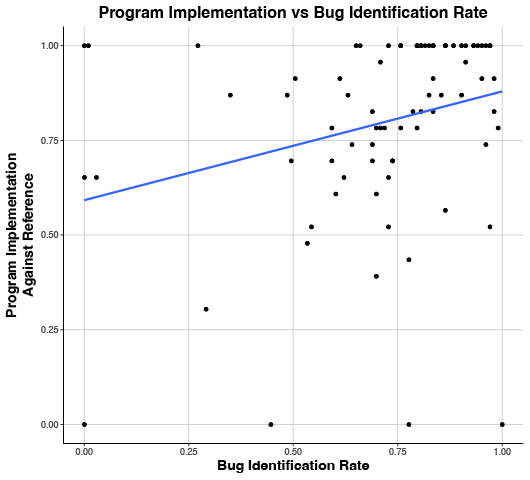
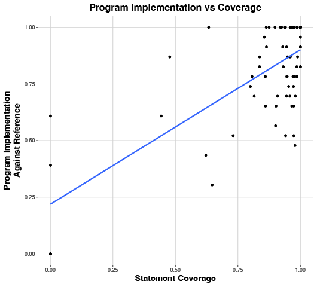
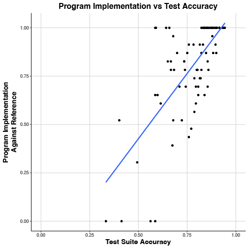

[comment]: # (Compile this presentation with the command below)
[comment]: # (mdslides index.md && mv index/index.html .)
[comment]: # (THEME = night)
[comment]: # (CODE_THEME = base16/zenburn)
[comment]: # (The list of themes is at https://revealjs.com/themes/)
[comment]: # (The list of code themes is at https://highlightjs.org/)
[comment]: # (Pass optional settings to reveal.js:)
[comment]: # (controls: true)
[comment]: # (keyboard: true)
[comment]: # (progress: true)
[comment]: # (width: "1024")
[comment]: # (markdown: { smartypants: true })
[comment]: # (hash: false)
[comment]: # (respondToHashChanges: false)
[comment]: # (Other settings are documented at https://revealjs.com/config/)

### Thinking Like a Tester

----------

Kevin Buffardi, Ph.D.

Professor, California State University, Chico

[LearnByFailure.com](https://learnbyfailure.com/)


</img>

<sub>[LearnByFailure.com](https://learnbyfailure.com/thinking-like-a-tester/)</sub>

[comment]: # (!!!)

#### What is software testing?

----------

* Systematic way to verify whether or not software is doing what is intended
* [Majority of effort spent on software projects](https://dl.acm.org/doi/10.1145/3057269)
* Sooner we discover faults, the better
  * Automated tests
  * E.g. Unit tests - verify smallest "unit" of code
  * Regression tests


[comment]: # (!!!)

#### Example Unit Test

----------

* Given a function **place_piece** that receives **row** and **column** coordinates (each 0-2, inclusive), update the Tic-Tac-Toe board of the current player's mark (`X` or `O`) if the space is not yet occupied and return the character of the piece placed. Otherwise, if there is already a piece at that location return **'@'** or the coordinates are invalid, return **'?'**.

[comment]: # (||| data-auto-animate)

#### Example Unit Test

----------

Example unit test assertions, 

comparing **actual** and **expected** values:

```ASSERT_EQ( game.place_piece(0,0) , 'X' );```

```ASSERT_EQ( game.place_piece(-1,0) , '?' );```


[comment]: # (!!!)

#### Conventional Testing Metrics

----------

* **Coverage** - After all tests are run, what % of production code has been run?
* **Testing effectiveness** - Percentage of faults caught by tests?
  * **Mutation Testing** - Make "mutant" variants of code, are they "killed" by tests?

* What are limitations to these metrics?

[comment]: # (!!!)

#### What about Positive Verification?

----------

* Vice versa to **testing effectiveness**, how reliable are tests at **positively verifying** software requirements?
* All-Pairs Function testing, by Function-Under-Test
  * Does test find bugs in faulty implementations (testing effectiveness)
  * Does test verify functionality in acceptible implementations (positive verification)
* Struggles with either **positive verification** *or* **test effectiveness**, but rarely both on the same function [Buffardi and Valdivia, 2019](http://hdl.handle.net/10125/60199)

[comment]: # (!!!)

#### Measuring Testing Accuracy

----------

* How are **testing effectiveness** and **positively verification** related with a lack of faults? [Buffardi, Valdivia, and Rogers, 2019](https://doi.org/10.1145/3287324.3287351)
  * **Accuracy** = (True Positives + True Negatives) / (True Positives + True Negatives + False Positives + False Negatives)
  * **Accuracy** stronger correlation with lack of bugs than either **Test Effectiveness** or **Coverage**

[comment]: # (|||)



(ρ=.355, p<.0167)

[comment]: # (|||)



(ρ=.514, p<.001)

[comment]: # (|||)



(ρ=.648, p<.001)

[comment]: # (!!!)

#### Thinking Like a Tester

----------

<small>This presentation is accessible at [learnbyfailure.com/thinking-like-a-tester/](https://learnbyfailure.com/thinking-like-a-tester/) and its source is available on [GitHub](https://github.com/kbuffardi/thinking-like-a-tester/).</small>


</img>

<small>[Back to LearnByFailure](https://learnbyfailure.com/research/)
</small>
